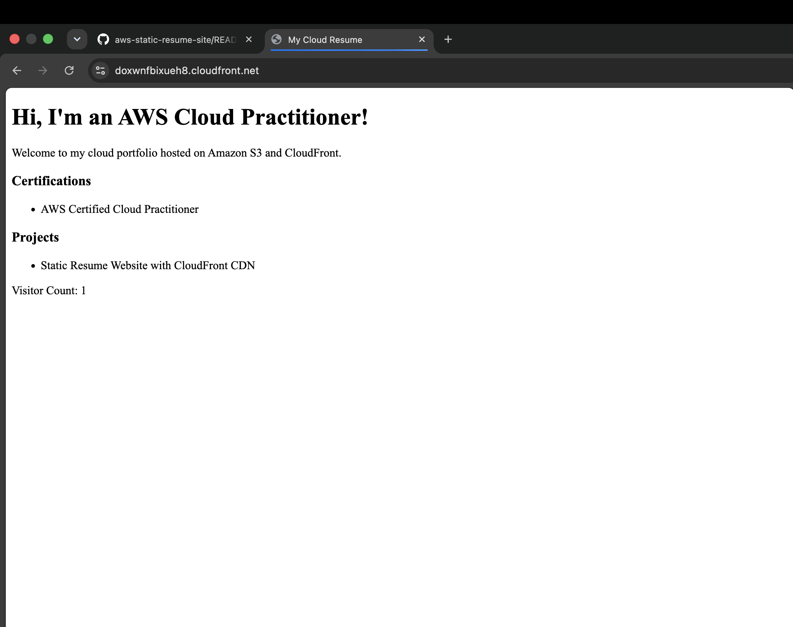

# AWS Static Resume Site with CloudFront CDN

## Overview
This repository contains the frontend static assets for my cloud resume, hosted using AWS S3 and distributed globally with Amazon CloudFront.

## Architecture & Features
* **AWS S3 (`daniyal-cloud-resume-2026`)**: Stores static HTML, CSS, and client-side JavaScript.
* **Amazon CloudFront (`doxwnfbixueh8`)**: CDN configured to securely serve content globally over HTTPS with fast edge-caching.
* **Dynamic Counter Integration**: Client-side JavaScript fetches live visitor data directly from an Amazon API Gateway backend.
## Proof of Concept

